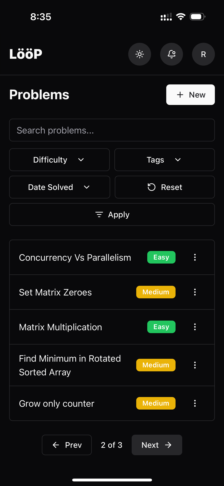
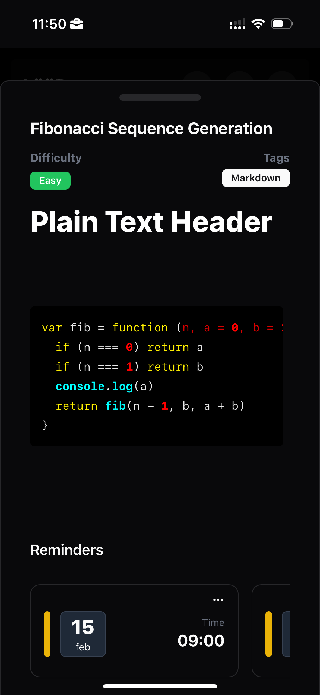
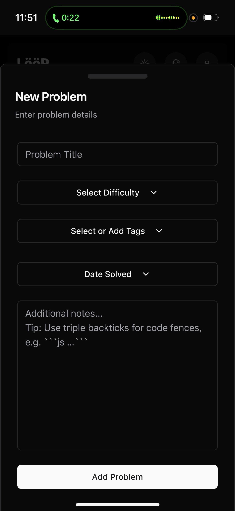
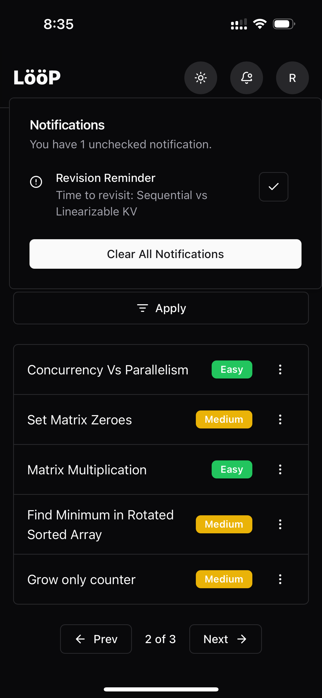

# **LööP**

From DSA drills to everyday challenges, LooP lets you log problems and nudges you to revisit them with smart reminders, turning practice into lasting retention.

## Features

- 📱 Minimal, Themed, and Fully responsive UI with drawer-based mobile UX.
- 🔒 Authentication via GitHub OAuth and Email.
- ✅ Log problems with difficulty levels and tags.
- 🧠 Smart filters (search, tags, difficulty, and solve date).
- 🔔 Receive intelligent reminders for problems based on previous recall feedback fed to the SM-2 algorithm.
- 🔔 Set manual reminders for problems (push notifications supported).
- 📶 Offline support backed by IndexedDB + Service Worker APIs.
- 🔃 Background sync to reconcile offline actions when back online.
- 📦 PWA installable experience with native push support.

## 👥 Contributing
To contribute, visit the [issues page](https://github.com/romeo-folie/LooP/issues)

## 🛡️ License
GNU

## Screenshots

### Dashboard

### Problem Details

### Problem Form

### Notifications
